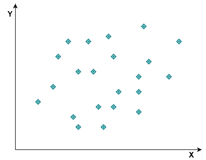
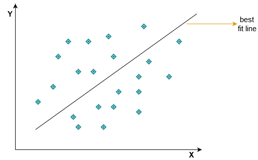

In this lesson we will try and get a high level intuitive understanding of how linear regression works.
Regression analysis is often used to model causes and effects, the cause being the independent variable and can also be referred to as the explanatory/predictor variable (`X`), the effect is the dependent variable i.e the variable that is dependent on the cause.  

## Let's consider simple linear regression;
Simple linear regression is a regression where we have exactly 1 `X` variable. Simple linear regression is easy to understand because the data points used for the regression analysis can be plotted on a two dimensional plane like in the diagram below  



## So what exactly is linear regression? 
Linear regression involves finding the best fit line through the data points  

 

The line is what is used for prediction.  

## So what is the regression line?  

The regression line also known as best fit line is that line which minimizes the variance of the residuals (Mean Square Error). The residuals in this case are the difference between the actual values of the dependent variable and the fitted values of the dependent variable.  

When there are more than one explanatory variable the regression becomes *Multiple Regression*. The same objective of the simple linear regression applies to the multiple regression, i.e To minimize the variance of the residuals.  

Now after performing regression analysis (whether simple linear regression or multiple regression) we need a way to be able to evaluate our result, one of the ways we can evaluate the result is by using the $R^{2}$ metric  
$R^{2}$ = ESS / TSS  
where   
`ESS` stands for EXPLAINED SUM OF SQUARES (variance of the fitted values)  
`TSS` stands for TOTAL SUM OF SQUARES (variance of the actual values)  
The $R^{2}$ metric measures the percentage of total variance explained by the regression. The higher the $R^{2}$ the better the quality of the regression analysis.  

In multiple regression the $R^{2}$ metric is not used directly, we make use of the adjusted $R^{2}$, and this is because in multiple regression there may be variables which are not relevant. The adjusted $R^{2}$ adds an additional penalty to handle variables that are not really relevant in the analysis.  

In summary, the best fit regression line is the line that produces the best $R^{2}$  

Another way to evaluate the result of a regression analysis is by using the `RMSE` metric. The root mean square error is a preferred evaluation choice for some people, it can be obtained by taking the root of the Mean Square Error.

# EXAMPLE  

Now that we know what regression analysis is and how to evaluate the result let us use an example to gain a practical knowledge of what we have discussed.

For this example we are going to build the linear regression model first using base R and then using tidymodels..


We will be making use of the `Real Estate Dataset` from kaggle for this example. Our aim is to predict house price given some features like *date of purchase*, *house age*, *number of convinience stores* ,*location*, and *distance to nearest mrt station*.  

Before proceeding let us make some few assumptions about the dataset since we didn't get much information about the dataset from kaggle. 
Bellow are the assumptions;  
1. The house price of unit area is in thousands of dollars  
2. The distance to nearest mrt station is distance in miles  

Now let us load all the packages that we will need for this example  
```{r, message=FALSE}
require(tidyverse)
require(tidymodels)
require(GGally)
```

### Read data into rstudio environment  

```{r}
real_estate <- read_csv("https://raw.githubusercontent.com/twirelex/dataset/master/real_estate.csv") %>% janitor::clean_names()
```  
### View data types and see summary statistics  

```{r}
dim(real_estate)
```


```{r}
glimpse(real_estate)
```  
**remove the `no` column as it is only an identifier and doesn't really need to be part of the variables**

```{r}
real_estate <- real_estate %>% 
  select(-no)
```

```{r}
knitr::kable(head(real_estate))
```

### EXPLORATORY DATA ANALYSIS   

```{r}
summary(real_estate)
```  

Looking at the summary statistics above we can see that variables like `distance_to_the_nearest_mrt_station` has a mean value that is very high when compared to other variables like the `number_of_convinience_stores` and `house_age`, these large values will have effect on our model if used as is, so we will have to standardize the variables in the pre-processing stage before building our model so that all the variables can have values that will not cause bias in our model.  


```{r, fig.width=18, fig.height=10}
ggpairs(real_estate, upper = NULL)
```  


These are some of the things that can be observed from the plot above  
* Most of the variables are not normally distributed
* The `distance_to_the_nearest_mrt_station` has a negative correlation with the `house price` 
* The `transaction date` variable doesn't really have effect on the `house price` 
* The `house age` variable has a negative correlation with the `house price`  
* The `number_of_convinience_stores` has a fairly positive correlation with the `house price`

### DATA PRE-PROCESSING  
The only pre-processing we will do before building our model is standardization. We want our variables to have a mean close to zero and a standard deviation of 1. We will do this with the scale function in r.

```{r}
real_estate_standard <- cbind(price = real_estate$y_house_price_of_unit_area, data.frame(scale(real_estate[1:6])))
```  

**verify that the explanatory variables have been standardized**  
```{r}
knitr::kable(head(real_estate_standard))
```


### MODELING THE BASE R WAY
The `lm` function can be used to perform regression analysis in r.  

Let us first build a simple linear regression where there is only one explanatory/independent variable.

```{r}
set.seed(11)

simp_model <- lm(price~ x2_house_age, data = real_estate_standard)
```

We can use the summary function in r to view information about the model  

```{r}
summary(simp_model)
```
For this model we got an R-squared of 0.04202, house age has a negative correlation with the house price. The p-value also tells us that the house age variable is a significant variable. 

**Now let us build a multiple linear regression model where there are more than one independent variable.**  
```{r}
set.seed(111)

mul_model <- lm(price~., data = real_estate_standard)
```

```{r}
summary(mul_model)
```
We can see that there is an improvement in the adjusted R-squared after we used all the independent variables. The `longitude` and `transaction date` variables didn't really have much significant effect in the model considering their p-values.

**Now let us calculate the root mean square error**

```{r}
sqrt(mean(mul_model$residuals^2))
```  

### MODELING THE TIDYMODELS WAY
Let us now build the same type of multiple regression that we built in base r using tidymodels 

**We will first pre-process the data using recipe**
```{r}
my_rec <- recipe(y_house_price_of_unit_area~., data = real_estate) %>% 
  step_normalize(all_predictors()) %>% 
  prep()

real_estate_standard2 <- bake(my_rec, real_estate)
```
the above process is similar to the one we did in base r with the scale function.


**view and verify the pre-processed data**
```{r}
knitr::kable(head(real_estate_standard2))
```


#### build model  

We will build the model using the `glmnet` engine so that wen tune some hyper-parameters

```{r}
model <- linear_reg(penalty = tune(), mixture = tune() ) %>% 
  set_engine("glmnet")
```

Now we will use the grid_max_entropy function to make a combination of values that we would like to try for both the `penalty` and the `mixture` hyper-parameters
```{r}
model_grid <- grid_max_entropy(penalty(), mixture(), size = 20)

knitr::kable(head(model_grid, 10))
```


**Create a 10-folds cross-validation**
```{r}
model_cv <- vfold_cv(real_estate_standard2, strata = y_house_price_of_unit_area, v = 10)
```

**So that we don't wait too long we will activated parallel processing**
```{r, message=FALSE}
require(doSNOW)

cl <- makeCluster(4, type = "SOCK")

registerDoSNOW(cl)
```

**Now we tune our specifications using the tune_grid function**
```{r}
tuning <- tune_grid(model,y_house_price_of_unit_area~.,resamples = model_cv, grid = model_grid)
```

**We will use the select_best function to select the best values for our hyper-parameters so that we can use those values to build our model**
```{r}
best_tune <- tuning %>% select_best()
``` 

**We can now finalize our model by inserting those values we obtained from the select_best function into the `penalty` and `mixture` parameters that we didn't specify any value for initially**

```{r}
model <- model %>% finalize_model(best_tune)
```


**Now we fit the model and make predictions**
```{r}
model <- model %>% fit(y_house_price_of_unit_area~., data = real_estate_standard2) %>% predict(real_estate_standard2) %>% mutate(truth = real_estate_standard2$y_house_price_of_unit_area)
  
```

**Model Evaluation**
```{r}
model %>% metrics(truth = truth, estimate = .pred)
```

Though there is no improvement in the model after using tidymodels and tuning for penalty and mixture, there are ways we can try to improve the model but that wasn't what our goal was for this lesson.  

### CONCLUSION  
R provides us with a convenient way of performing regression analysis and with the help of tidymodels we can do more advanced and robust analysis like applying bootstrap resampling, cross-validation etc..